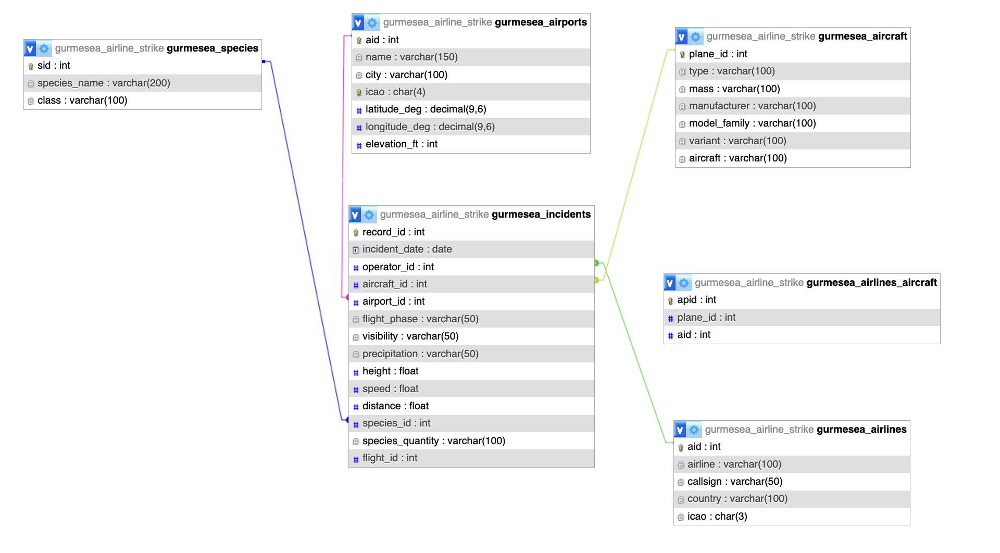

# Species & Aviation Data Loader

The starting point of this work was a csv file that contains the strike that happened between 1990 - 1992. The data contains 66 columns and 174104 raw rows.

| Dtype   | Columns                                                                                                                                                                                                                                                                                                                                                                                                                                                                                                                                                                |
| ------- | ---------------------------------------------------------------------------------------------------------------------------------------------------------------------------------------------------------------------------------------------------------------------------------------------------------------------------------------------------------------------------------------------------------------------------------------------------------------------------------------------------------------------------------------------------------------------- |
| int64   | Record ID, Incident Year, Incident Month, Incident Day, Aircraft Damage, Radome Strike, Radome Damage, Windshield Strike, Windshield Damage, Nose Strike, Nose Damage, Engine1 Strike, Engine1 Damage, Engine2 Strike, Engine2 Damage, Engine3 Strike, Engine3 Damage, Engine4 Strike, Engine4 Damage, Engine Ingested, Propeller Strike, Propeller Damage, Wing or Rotor Strike, Wing or Rotor Damage, Fuselage Strike, Fuselage Damage, Landing Gear Strike, Landing Gear Damage, Tail Strike, Tail Damage, Lights Strike, Lights Damage, Other Strike, Other Damage |
| float64 | Aircraft Mass, Engine Make, Engines, Engine2 Position, Engine4 Position, Height, Speed, Distance, Fatalities, Injuries                                                                                                                                                                                                                                                                                                                                                                                                                                                 |
| object  | Operator ID, Operator, Aircraft, Aircraft Type, Aircraft Make, Aircraft Model, Engine Model, Engine Type, Engine1 Position, Engine3 Position, Airport ID, Airport, State, FAA Region, Warning Issued, Flight Phase, Visibility, Precipitation, Species ID, Species Name, Species Quantity, Flight Impact                                                                                                                                                                                                                                                               |

The data was the base point from this I wanted to acheive the points below

- 1 Create a bucket by taking the species name and decrease the types

  I researched for sites that can get me the rank,kingdom,phylum,class based on species name. Most sites I found were paid for and since I had 773 species that was not an option. I then found GBIF (the Global Biodiversity Information Facility). It is an international network and data infrastructure funded by the world's governments and aimed at providing anyone, anywhere, open access to data about all types of life on Earth. I used https://api.gbif.org/v1/species/search end point. The end point takes one species at a time so I had to create 20 Threads to shorten the fetching time and went through the 773 species. The return data per species is a list of entries with these keys input_name,usageKey,scientificName,canonicalName,rank,kingdom,phylum,class,order,family,genus,species,taxonomicStatus. Since one species has many class names I had to find a way to do 1to1 mapping. After this I created a function to count the species and the classes and then take the class with the highest count and then populate mySQL table accordingly.

- 2 Using the airport icao fetch information about the location of the airport

  There are many companies that offers airport information details. But almost all had some fee attached to them. I used https://api.aviationstack.com/v1/airports. I was able to get the id,gmt,airport_id,iata_code,city_iata_code,icao_code,country_iso2,geoname_id,latitude,longitude,airport_name,country_name,phone_number,timezone.

- 3 Create a migration information and map that to the flights

  Although I have attempted this I was faced with many blockers starting from how the data was first shaped. The incident location is not in the data hence there is no way I can relate the path of the species migration to the incident location. Instead what I did was use Cornell Lab of Ornithology (https://api.ebird.org/v2/data/obs/KZ/recent) to study the migration of birds and see if the seasonality information I get from the data analysis I did in the end truly aligns which did.

After collecting all data locally since it was alot I had to execute them by batch. I took one batch populated my dimension tables then got the id of those rows then populated my fact table with the ids and other attributes.
Using these tables I answered the question below.

## Questions & Analyses

### Dynamic summaries

#### 1. By Species / Taxonomic Class

**1.1 Species-level frequency**  
_Which species are involved in the highest number of incidents?_

Top 10 species by incident count:

| Rank | Species | Taxonomic Class | Incidents |
| --- | --- | --- | --- |
| 1 | UNKNOWN SMALL BIRD |  | 887 |
| 2 | GULL | Arfiviricetes | 689 |
| 3 | SPARROW | Chytridiomycetes | 170 |
| 4 | BLACKBIRD | Repensiviricetes | 144 |
| 5 | ROCK PIGEON | Aves | 113 |
| 6 | EUROPEAN STARLING | Aves | 95 |
| 7 | CANADA GOOSE | Insthoviricetes | 83 |
| 8 | WHITE-TAILED DEER | Mammalia | 74 |
| 9 | DUCK | Aves | 71 |
| 10 | HAWK | Insthoviricetes | 68 |

---

_Which species are involved in the low number of incidents?_

Bottom 10 species by incident count:

| Rank | Species | Taxonomic Class | Incidents |
| --- | --- | --- | --- |
| 1 | SAVANNAH SPARROW | Aves | 1 |
| 2 | EASTERN SCREECH-OWL | Aves | 1 |
| 3 | DOMESTIC CAT | Mammalia | 1 |
| 4 | OLD WORLD VULTURES |  | 1 |
| 5 | NORTHERN MOCKINGBIRD | Aves | 1 |
| 6 | GREEN-WINGED TEAL | Insthoviricetes | 1 |
| 7 | YELLOW-BILLED CUCKOO | Aves | 1 |
| 8 | WOODCHUCK | Revtraviricetes | 1 |
| 9 | EASTERN KINGBIRD | Aves | 1 |
| 10 | FOXES | Mammalia | 1 |

---

**1.2 Class-level patterns**  
_Which taxonomic class (e.g., birds vs. mammals vs. other) is most commonly involved in incidents?_

Incident counts by class:

| Class | Incidents |
| --- | --- |
|  | 937 |
| Aves | 803 |
| Arfiviricetes | 689 |
| Insthoviricetes | 228 |
| Chytridiomycetes | 170 |
| Repensiviricetes | 144 |
| Mammalia | 80 |
| Trematoda | 41 |
| Gastropoda | 23 |
| Cyanophyceae | 12 |

---

**1.3 Species–airport spread**  
_For each species, at how many different airports has it been recorded in incidents?_

Top 10 species by number of affected airports:

| Rank | Species | Class | # Airports |
| --- | --- | --- | --- |
| 1 | UNKNOWN SMALL BIRD |  | 211 |
| 2 | GULL | Arfiviricetes | 186 |
| 3 | SPARROW | Chytridiomycetes | 98 |
| 4 | BLACKBIRD | Repensiviricetes | 85 |
| 5 | WHITE-TAILED DEER | Mammalia | 58 |
| 6 | EUROPEAN STARLING | Aves | 58 |
| 7 | ROCK PIGEON | Aves | 58 |
| 8 | DUCK | Aves | 55 |
| 9 | CANADA GOOSE | Insthoviricetes | 52 |
| 10 | HAWK | Insthoviricetes | 49 |

---

#### 2. By Airport / Airline

**2.1 Airport risk**  
_Which airports have the highest number of wildlife incidents?_

Top 10 airports by incident count:

| Rank | Airport | ICAO | Incidents |
| --- | --- | --- | --- |
| 1 | DALLAS/FORT WORTH INTL ARPT | KDFW | 138 |
| 2 | NASHVILLE INTL | KBNA | 81 |
| 3 | CHICAGO O'HARE INTL ARPT | KORD | 65 |
| 4 | JOHN F KENNEDY INTL | KJFK | 60 |
| 5 | LA GUARDIA ARPT | KLGA | 60 |
| 6 | NORFOLK INTL | KORF | 57 |
| 7 | PHILADELPHIA INTL | KPHL | 47 |
| 8 | SAN FRANCISCO INTL ARPT | KSFO | 47 |
| 9 | PITTSBURGH INTL ARPT | KPIT | 44 |
| 10 | MIAMI INTL | KMIA | 43 |

---

**2.2 Airline risk**  
_Which airlines have the most incidents?_

Top 10 airlines by incident count:

| Rank | Airline | ICAO | Incidents |
| --- | --- | --- | --- |
| 1 | AMERICAN AIRLINES | AAL | 811 |
| 2 | BUSINESS | BUS | 468 |
| 3 | 1US AIRWAYS | USA | 341 |
| 4 | SOUTHWEST AIRLINES | SWA | 154 |
| 5 | MILITARY | MIL | 149 |
| 6 | PRIVATELY OWNED | PVT | 147 |
| 7 | UNITED AIRLINES | UAL | 117 |
| 8 | DELTA AIR LINES | DAL | 91 |
| 9 | NORTHWEST AIRLINES | NWA | 91 |
| 10 | CONTINENTAL AIRLINES | COA | 68 |

---

#### 3. Temporal Patterns

**3.1 Trends over time**  
_How have incident counts changed by year?_

Incident counts by year:

| Year | Incidents |
| --- | --- |
| 1990 | 1192 |
| 1991 | 1433 |
| 1992 | 531 |

---

**3.2 Seasonality**  
_Are incidents more common in certain months or seasons?_

By month:

| Month # | Month | Incidents |
| --- | --- | --- |
| 5 | May | 401 |
| 9 | September | 372 |
| 8 | August | 346 |
| 10 | October | 333 |
| 7 | July | 324 |
| 6 | June | 315 |
| 11 | November | 255 |
| 4 | April | 225 |
| 3 | March | 181 |
| 12 | December | 136 |
| 1 | January | 136 |
| 2 | February | 132 |

Based on the incident data, wildlife strikes peak in **May** and **September**.  
This pattern is consistent with independent migration data which I found on :

- eBird Status & Trends and BirdCast show the highest migration intensity during late spring (May) and early fall across much of North America.
- USGS waterbird migration studies define spring migration as April–May and fall migration as August–October, bracketing the May and September peaks seen in our dataset.

Although this might feel over generalization since exact timing varies by species and latitude these external data sources support that our “migration" might be causing higher incident in these months.
